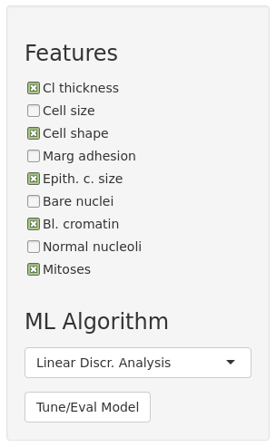
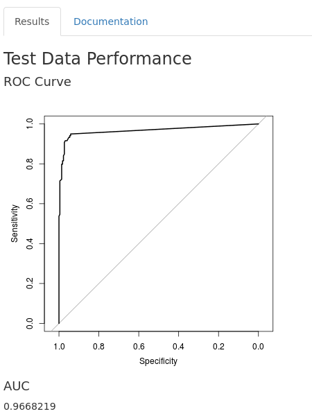

Breast Cancer Diagnosis with Machine Learning
========================================================
author: Alessandro Vullo
date: October 24th, 2017
width: 1440
height: 900

Overview
========================================================

**The Problem**

Identify whether each of a number of clinical cases of breast cancer is benign or malignant.

An interactive Shiny app has been developed with the following features:

- train and evaluate alternative Machine Learning algorithms on the [Wisconsin Breast Cancer Database](https://archive.ics.uci.edu/ml/datasets/Breast+Cancer+Wisconsin+(Diagnostic);
- allow the user to select which features to include in the model and which algorithm to apply;
- display performance on a test set using ROC/AUC.

<https://avullo.shinyapps.io/developing_data_products_course_project/>

The Dataset
========================================================

- Available from package _mlbench_ as the BreastCancer dataset: 699 observations on 11 variables (1 character variable, 9 ordered/nominal and 1 target class);


```r
str(BreastCancer)
```

```
'data.frame':	699 obs. of  11 variables:
 $ Id             : chr  "1000025" "1002945" "1015425" "1016277" ...
 $ Cl.thickness   : Ord.factor w/ 10 levels "1"<"2"<"3"<"4"<..: 5 5 3 6 4 8 1 2 2 4 ...
 $ Cell.size      : Ord.factor w/ 10 levels "1"<"2"<"3"<"4"<..: 1 4 1 8 1 10 1 1 1 2 ...
 $ Cell.shape     : Ord.factor w/ 10 levels "1"<"2"<"3"<"4"<..: 1 4 1 8 1 10 1 2 1 1 ...
 $ Marg.adhesion  : Ord.factor w/ 10 levels "1"<"2"<"3"<"4"<..: 1 5 1 1 3 8 1 1 1 1 ...
 $ Epith.c.size   : Ord.factor w/ 10 levels "1"<"2"<"3"<"4"<..: 2 7 2 3 2 7 2 2 2 2 ...
 $ Bare.nuclei    : Factor w/ 10 levels "1","2","3","4",..: 1 10 2 4 1 10 10 1 1 1 ...
 $ Bl.cromatin    : Factor w/ 10 levels "1","2","3","4",..: 3 3 3 3 3 9 3 3 1 2 ...
 $ Normal.nucleoli: Factor w/ 10 levels "1","2","3","4",..: 1 2 1 7 1 7 1 1 1 1 ...
 $ Mitoses        : Factor w/ 9 levels "1","2","3","4",..: 1 1 1 1 1 1 1 1 5 1 ...
 $ Class          : Factor w/ 2 levels "benign","malignant": 1 1 1 1 1 2 1 1 1 1 ...
```

- Dataset is split (50/50) into training (resp. testing) set to tune model (resp. evaluate performance)

Using the Application
========================================================
left: 30%


***

All controls are in the sidepanel on the left

* __Feature Selection__
  + control the set of features the model will be built on;
  + default to all features, can disable a subset of them by toggling the corresponding checkbox

* __Algorithm Selection__
  + choose which Machine Learning algorithm to train and test on this task
  + K-Nearest Neighbor/Linear Discriminat Analysis (simple/appropriate alternatives for this task)
  
* Press __Tune/Eval Model__ to go!
  + tune a model on the training set using bootstrapped resampling procedure
  + trained model used to predict benign/malignant class probabilities on test set

Output
========================================================
left: 40%


***
- Plot of the ROC curve relative to the test set
  + show how specificity relates to sensitivity by varying the probability decision threshold;
- Value of the Area Under the ROC Curve (AUC)
  + ~0.5 (nearly random prediction behaviour); ~1 (nearly perfect classification)
- Extensive documentaion available in the other tab.
